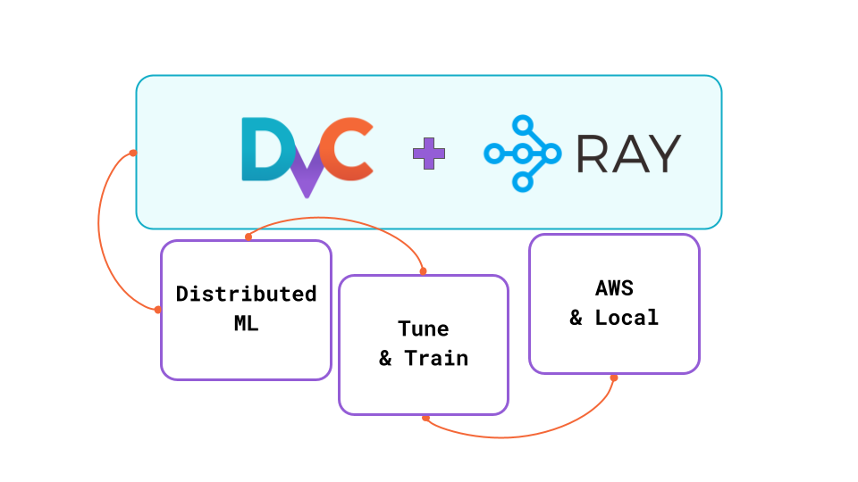

# 🎓 Tutorial: Automated Distributed ML Pipelines with DVC and Ray

This tutorial will guide users through creating automated, scalable, and distributed ML pipelines using DVC (Data Version Control) integrated with Ray. 

- Run Distributed ML Pipeline with DVC [DVC](https://dvc.org/). 
- Design distributed ML pipeliens with Ray [Ray](https://www.ray.io/). 
- Introduce [Ray Tune](https://docs.ray.io/en/latest/tune/index.html) for hyperparameter optimization
- Run distributed ML experiment with DVC and Ray on AWS



## Install

```bash
python -m venv .venv
source .venv/bin/activate
pip install -r requirements.txt
```


## Run DVC pipeline on Ray Cluster (local)

### 1 - Start a Ray Cluster (local)

Locally: cpu, single-node

```bash
export RAY_ENABLE_WINDOWS_OR_OSX_CLUSTER=1
ray start --head
```

To test running cluster you may run a test script : 

```bash
# Run a Python script with ray.init() 
python src/test_scripts/hello_cluster.py

# Submit a script as a Job
ray job submit -- python src/test_scripts/hello_cluster.py
```

With running Ray Cluster you can submit a job:


### 2 - Run DVC pipeline

```bash
export PYTHONPATH=$PWD
dvc exp run
```

## Run DVC pipeline on Ray Cluster (AWS)


### 1 - Start a Ray Cluster on AWS

```bash
# Run a cluster
ray up cluster.yaml  
```

See more examples in [Ray Docs](https://docs.ray.io/en/latest/cluster/vms/examples/ml-example.html#clusters-vm-ml-example)

### 2 - Open Ray Dashboard

```bash
ray dashboard cluster.yaml
```

### 3 - Work with Ray Cluster

There are few options to interact with the Ray Cluster on AWS:

- Submit jobs (Ray scripts)
- Attach to an interactive screen session on the cluster
- Execute shell commands on the cluster


#### 3.1 - Submit ML trainig job to Ray Cluster

```bash
export RAY_ADDRESS='http://localhost:8265'
ray job submit --working-dir $PWD -- python src/test_scripts/mnist.py
```

#### 3.2 - Attach to an interactive screen session on the cluster (via SSH)

If you would like to run an application interactively and see the output in real time (for example, during development or debugging), you can кun your script directly on a cluster node (e.g. after SSHing into the node using `ray attach`

```bash
ray attach cluster.yaml
```

#### 3.3 - Execute shell commands on the cluster

Also, you may want to execute `shell` commands on a cluster 
```bash
ray exec cluster.yaml 'echo "hello world"'
```

### 4 - (option 1) Connect to the cluster and run DVC pipeline

Connect to the session on the cluster 
```bash
ray attach cluster.yaml
```

Run ML pipeline with DVC and commit results 
```bash
# Clone repo to the cluster
git clone https://github.com/mnrozhkov/tutorial-mnist-dvc-ray.git

# Navigate to the repo & run 
cd tutorial-mnist-dvc-ray
PYTHONPATH=/home/ray/tutorial-mnist-dvc-ray
dvc exp run
```

### 5 - (option 1) Run DVC pipeline on Ray Cluster from a laptop

Clone repo to the cluster

```bash
ray exec cluster.yaml "git clone https://github.com/mnrozhkov/tutorial-mnist-dvc-ray.git"
```

Execute `dvc exp run` command on the cluster

```bash
ray exec cluster.yaml "cd tutorial-mnist-dvc-ray && \
    export PYTHONPATH=/home/ray/tutorial-mnist-dvc-ray && \
    dvc exp run"
```

Download (sync) the repository to results

```bash
ray rsync_down cluster.yaml '/home/ray/tutorial-mnist-dvc-ray/' $PWD
```

Commit results if needed.


## Stop Cluster

Don't remember to stop remote cluster after work is done. Save money and the planet!

```bash
ray down cluster.yaml 
```
